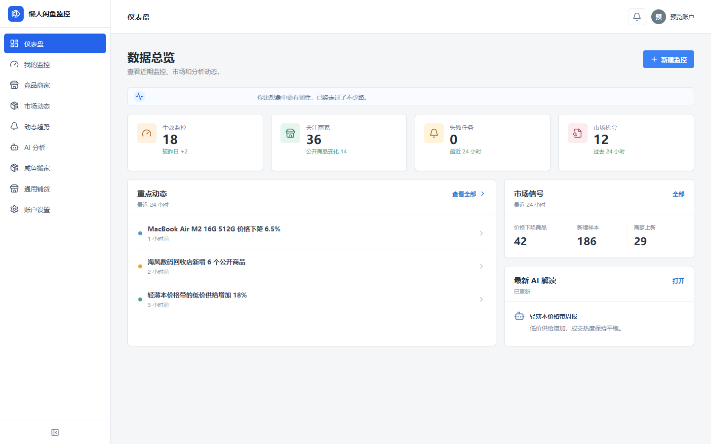
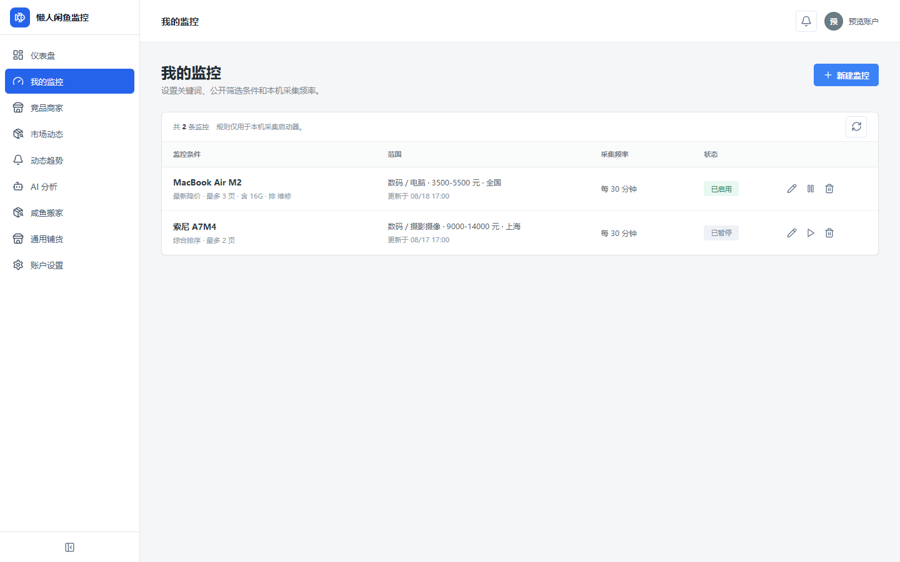
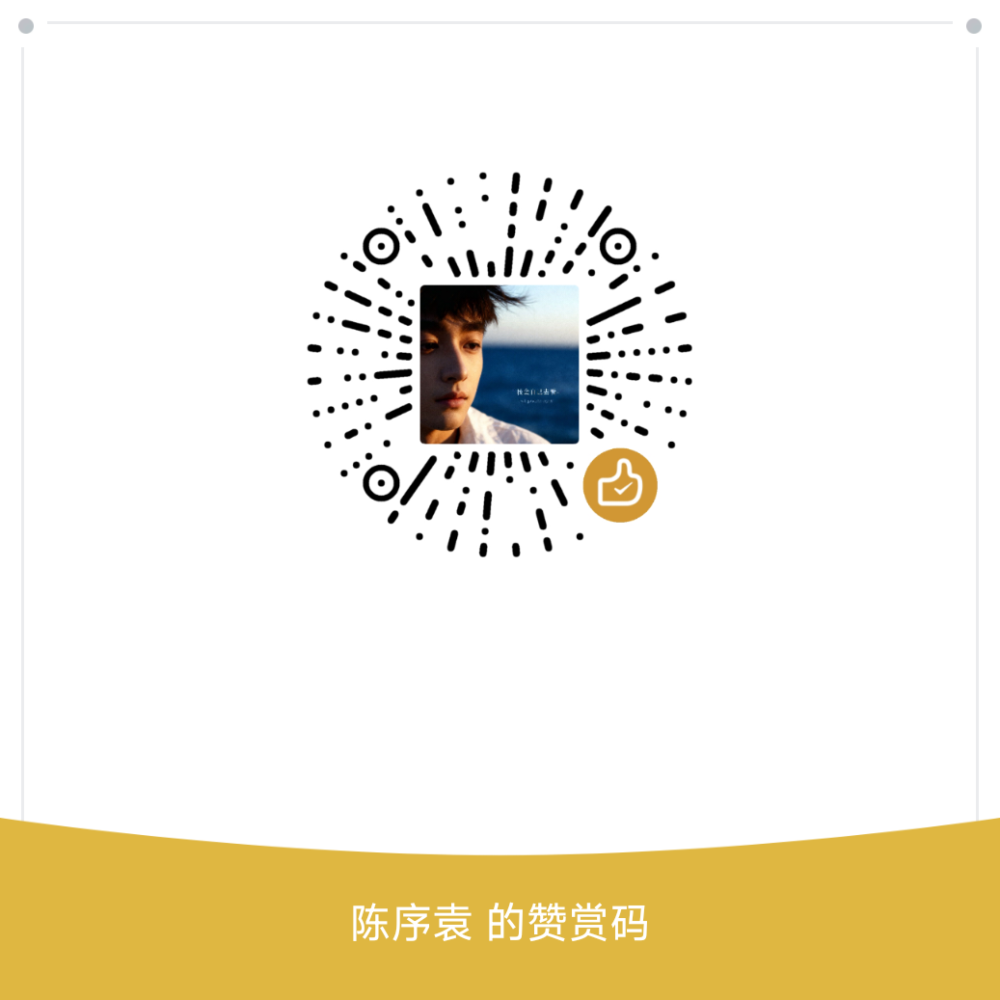

<p align="center">
  
  
  
</p>

<h1 align="center">懒人闲鱼监控</h1>

<p align="center">闲鱼公开商品与公开卖家数据监控工作台</p>

一个面向闲鱼公开商品和公开卖家数据的监控工作台。项目由本地 Electron 采集启动器、用户 Web、Admin Web 和云端 API 组成，支持搜索监控、竞品卖家监控、市场数据沉淀、静默上传和 AI 分析基础能力。

## 界面预览

| 用户工作台 | 我的监控 |
| --- | --- |
|  |  |

## 功能概览

### 本地采集启动器

- Windows Electron 客户端，负责本系统账号登录、设备绑定和采集控制。
- 使用本机专用 Chrome Profile 登录闲鱼，不把闲鱼 Cookie、Token 或浏览器 Profile 上传到云端。
- 支持关键词、类目、排序、价格、地区、包含词和排除词等搜索监控规则。
- 支持公开卖家主页监控，记录公开商品、上新、价格变化、下架、已售和资料变化事件。
- 使用本地 SQLite 保存任务、日志、缓存和 Outbox；断网后恢复网络可继续补传。
- 支持通过系统托盘隐藏运行、启动采集、暂停采集和退出。

### 用户 Web

用户 Web 是独立的 React/Vite 应用，包含：

- Dashboard
- 我的监控
- 竞品商家
- 市场商品池
- 市场发现
- 事件中心
- 动态日志
- AI 分析
- 设置

本地默认使用 demo 数据，配置 User API 后可切换到独立云端接口。

### Admin Web

Admin Web 使用独立登录和独立 API，包含运营概览、用户与设备、套餐订单与用量、市场数据、上传批次、AI 配置、队列容量和审计等管理页面。

### 云端服务

云端服务在一个进程中启动三个 Fastify API：

| 服务 | 默认端口 | 用途 |
| --- | ---: | --- |
| User API | `3101` | 用户登录、监控任务、市场数据和 AI 结果 |
| Admin API | `3102` | 用户、设备、套餐、数据质量、AI 和审计 |
| Collector API | `3103` | 设备心跳、任务同步、采集批次和静默上传 |

云端使用 PostgreSQL，数据库结构位于 [`infra/postgres/migrations`](infra/postgres/migrations)。用户、Admin 和采集器使用独立认证域和令牌配置。

## 架构

```text
闲鱼公开页面
        │
        ▼
本机 Chrome + Electron 采集启动器
        │ 任务同步 / 心跳 / 静默上传
        ▼
Collector API ─────── PostgreSQL ─────── User API ─────── User Web
        │                    │
        └────────────── Admin API ───── Admin Web
                             │
                         AI Worker
```

本地采集器和云端工作台是不同部署单元。云端不直接登录闲鱼，用户侧也不展示上传按钮、上传批次或云端 AI 密钥。

## 技术栈

- TypeScript
- Electron 43 + electron-vite
- React 19 + Vite
- Fastify 5
- PostgreSQL
- SQLite（Electron 本地数据）
- Playwright Core
- PGlite（集成测试）

## 快速开始

### 环境要求

建议使用当前 LTS Node.js 和 npm。云端脚本使用 Node 的 `--experimental-strip-types`，桌面端使用 Electron 内置的 `node:sqlite`，如果 Node 或 Electron 版本过旧，相关命令会无法启动。

安装依赖：

```bash
npm install
```

### 运行桌面采集启动器

```bash
npm run dev
```

启动后可以注册或登录本系统账号、打开本机 Chrome、绑定设备并启动采集。闲鱼登录仍在本机 Chrome 中完成。

构建桌面资源：

```bash
npm run build
```

构建 Windows 安装包：

```bash
npm run package:win
```

### 运行 User Web demo

```bash
Copy-Item apps/user-web/.env.example apps/user-web/.env
npm --prefix apps/user-web install
npm --prefix apps/user-web run dev
```

默认地址为 `http://127.0.0.1:5174`，默认 `VITE_USER_WEB_MODE=demo`，不会请求云端接口。

### 运行 Admin Web demo

```bash
Copy-Item apps/admin-web/.env.example apps/admin-web/.env
npm --prefix apps/admin-web install
npm --prefix apps/admin-web run dev
```

默认地址为 `http://127.0.0.1:5175`，默认 `VITE_ADMIN_DEMO_MODE=true`，使用本地演示数据。

### 运行云端服务

云端服务需要 PostgreSQL。先创建环境文件：

```bash
Copy-Item services/cloud/.env.example services/cloud/.env
```

然后修改 `services/cloud/.env` 中的数据库连接、三个认证域密钥和允许的 Web Origin。所有 `*_TOKEN_SECRET` 都必须替换为至少 32 字节的随机秘密，不能直接使用示例值。

在 PostgreSQL 中按顺序执行 [`infra/postgres/migrations`](infra/postgres/migrations) 下的 SQL 迁移，然后启动：

```bash
npm run serve:cloud
```

云端 API 默认监听：

- User API：`http://127.0.0.1:3101`
- Admin API：`http://127.0.0.1:3102`
- Collector API：`http://127.0.0.1:3103`

要让 User Web 连接云端 API，将 `apps/user-web/.env` 改为：

```dotenv
VITE_USER_WEB_MODE=api
VITE_USER_API_BASE_URL=http://127.0.0.1:3101
```

要让 Admin Web 连接云端 API，将 `apps/admin-web/.env` 改为：

```dotenv
VITE_ADMIN_DEMO_MODE=false
VITE_ADMIN_API_BASE_URL=http://127.0.0.1:3102
```

`.env` 文件不会被提交，仓库只保留 `.env.example`。

## 验证命令

常用构建和检查：

```bash
npm run build
npm --prefix apps/user-web run build
npm --prefix apps/admin-web run build
npm run check:cloud
```

阶段集成测试：

```bash
npm run test:phase0:contract
npm run test:phase0:stress
npm run test:phase2:cloud
npm run test:phase3:desktop
npm run test:phase5:cloud
npm run test:phase6:cloud
npm run test:phase7:cloud
```

桌面端测试会构建 Electron，并使用隔离的测试数据和模拟 API；它不能替代真实闲鱼账号、真实网络、生产数据库或线上部署验收。

## 数据和隐私边界

- 闲鱼账号登录态保存在采集器所在机器的专用 Chrome Profile 中。
- 云端只接收约定的公开商品、公开卖家、图片元数据、快照、事件和采集摘要。
- 本系统用户账号、Admin 账号和采集器设备属于不同认证域。
- 用户 Web 不包含 Admin API、上传控制、模型密钥或提示词配置入口。
- 不要提交 `.env`、真实密码、令牌、Cookie、浏览器 Profile、生产数据库备份或个人数据。
- 使用本项目时应遵守闲鱼平台规则、适用法律和数据主体权益要求，并自行确认采集频率和数据用途。

## 当前边界

仓库当前提供的是可运行的本地客户端、独立工作台和云端 API 基础实现。以下内容仍属于部署方的生产工作：

- 真实域名、TLS、反向代理和跨域配置
- PostgreSQL 高可用、备份恢复和迁移发布流程
- 对象存储、消息队列、搜索服务和容量扩展
- 生产监控、告警、限流和密钥轮换
- 真实闲鱼账号下的持续运行和平台规则适配
- 完整的多用户、多设备、断网恢复和线上回滚验收

数据库合同和阶段集成测试分别见 [`infra/postgres/migrations`](infra/postgres/migrations) 与 [`tools`](tools)。

## 目录结构

```text
apps/
  user-web/              用户 Web
  admin-web/             Admin Web
src/
  main/                  Electron 主进程、采集器、SQLite
  preload/               Electron IPC 边界
  renderer/              Electron 客户端界面
  shared/                共享类型
services/cloud/          User/Admin/Collector API 和 AI Worker
infra/postgres/migrations PostgreSQL 迁移
tools/                   阶段集成测试和运行时测试
```

## 联系与支持

<table border="1" cellpadding="12" cellspacing="0" width="100%">
  <tr>
    <td align="center" width="50%" style="border: 1px solid #d9d9d9; padding: 16px;">
      <strong>微信联系</strong><br />
      
    </td>
    <td align="center" width="50%" style="border: 1px solid #d9d9d9; padding: 16px;">
      <strong>赞赏支持</strong><br />
      
    </td>
  </tr>
</table>

## 许可证

本项目采用 [MIT License](LICENSE) 开源。使用本项目时仍需遵守闲鱼平台规则、适用法律和数据主体权益要求，并自行确认采集频率和数据用途。

欢迎通过 Issue 或 Pull Request 反馈问题。涉及账号、Cookie、Token、个人数据或生产地址的内容请先脱敏。
